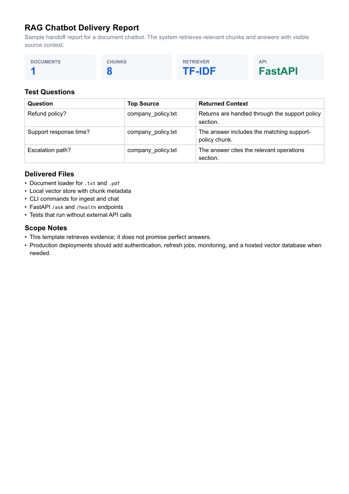

# RAG Chatbot Template

[](https://github.com/emirhuseynrmx/rag-chatbot-template/actions)
[](https://www.python.org/)

Local RAG chatbot template for documents, source-aware retrieval, and optional FastAPI endpoints.

The system retrieves relevant document chunks and answers with source-aware context. It does not claim perfect answers; it makes the retrieved evidence visible.

## Features

- ingest `.txt` and `.pdf` files
- chunk documents into overlapping text windows
- build a local TF-IDF vector store
- retrieve relevant chunks for a question
- generate a source-aware answer context
- return retrieved chunk ids, source paths, scores, and previews
- store chunking metadata with the local vector store
- expose `/ask` and `/health` with FastAPI
- tested without external API calls

## Demo

```bash
pip install -e ".[dev]"
rag-ingest documents --store vector_store/store.json
rag-chat "What does the refund policy say?" --store vector_store/store.json
uvicorn rag_chatbot_template.app:app --reload
```

## API

```bash
curl -X POST http://127.0.0.1:8000/ask \
  -H "Content-Type: application/json" \
  -d "{\"question\":\"What does the support policy say?\"}"
```

## Sample Delivery Report



## Run Tests

```bash
ruff check .
pytest
```

## Scope

This template works with user-provided documents. For production, add authentication, monitoring, document refresh jobs, and a hosted vector database if the corpus grows.
